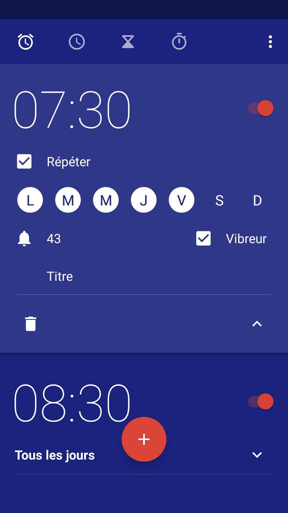
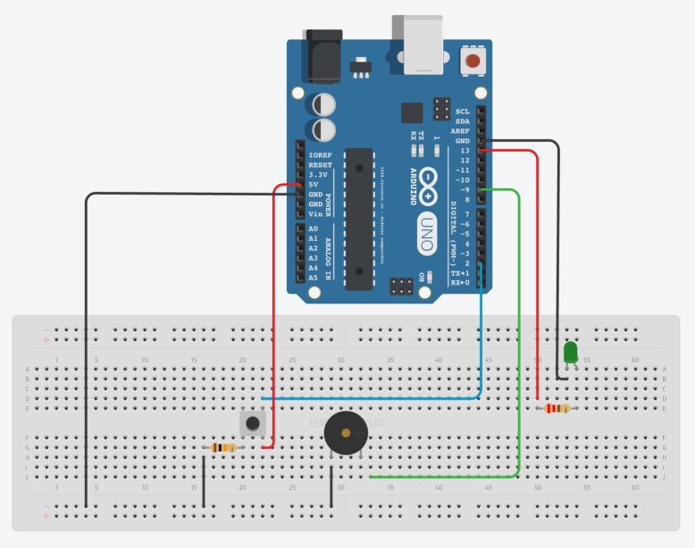

# Alarm clock on arduino controlled directly by a web interface

In this project, there is an alarm clock on the arduino and you can control the waking hour from a web interface.
The web interface should look like the android default alarm clock (see on the right).

> It could be done without cylon.js but the goal of the project is mainly pedagogic.

## Build the circuit

This circuit is an upgrade of the `button-led` project

Hardware required:

* 1 arduino
* 1 pushbutton
* 1 led
* 1 buzzer (active)
* 220 ohm resistor (for the led)
* 10k ohm resistor (for the pushbutton)
* 1 breadboard

More details:

* https://www.arduino.cc/en/Tutorial/Blink
* https://www.arduino.cc/en/tutorial/pushbutton
* https://www.arduino.cc/en/Tutorial/StateChangeDetection
* [LED in cylon.js](https://cylonjs.com/documentation/drivers/led/)
* [Connecting buzzer to arduino uno](https://startingelectronics.org/articles/arduino/connecting-buzzer-arduino-uno/)
* [What using active buzzer](http://forum.arduino.cc/index.php?topic=129741.0)

## Node.js

There is no cylon.js api for the buzzer so you have to use the [direct-pin api](https://cylonjs.com/documentation/drivers/direct-pin/).
