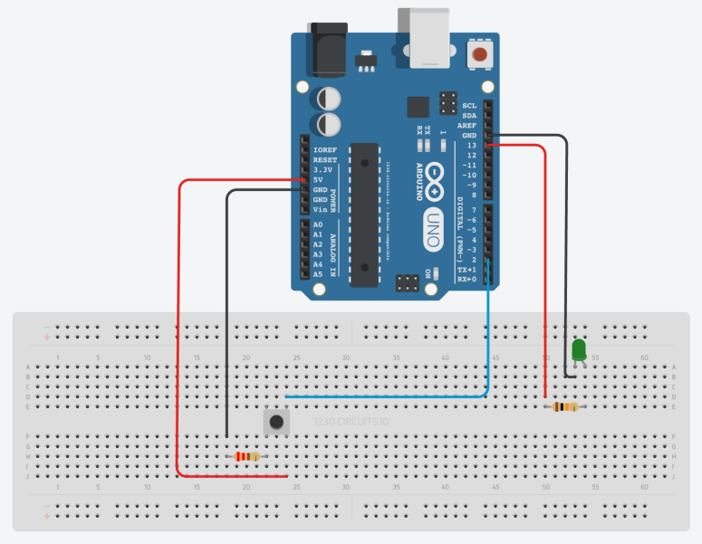

# Simple project to control arduino from computer

In this project, a led on the arduino will be controlled by a push button.

## Build the circuit

Hardware require:

* 1 arduino
* 1 pushbutton
* 1 led
* 220 ohm resistor (for the led)
* 10k ohm resistor (for the pushbutton)
* 1 breadboard

More details:

* https://www.arduino.cc/en/Tutorial/Blink
* https://www.arduino.cc/en/tutorial/pushbutton
* https://www.arduino.cc/en/Tutorial/StateChangeDetection

## Node.js

    node button-led.js
